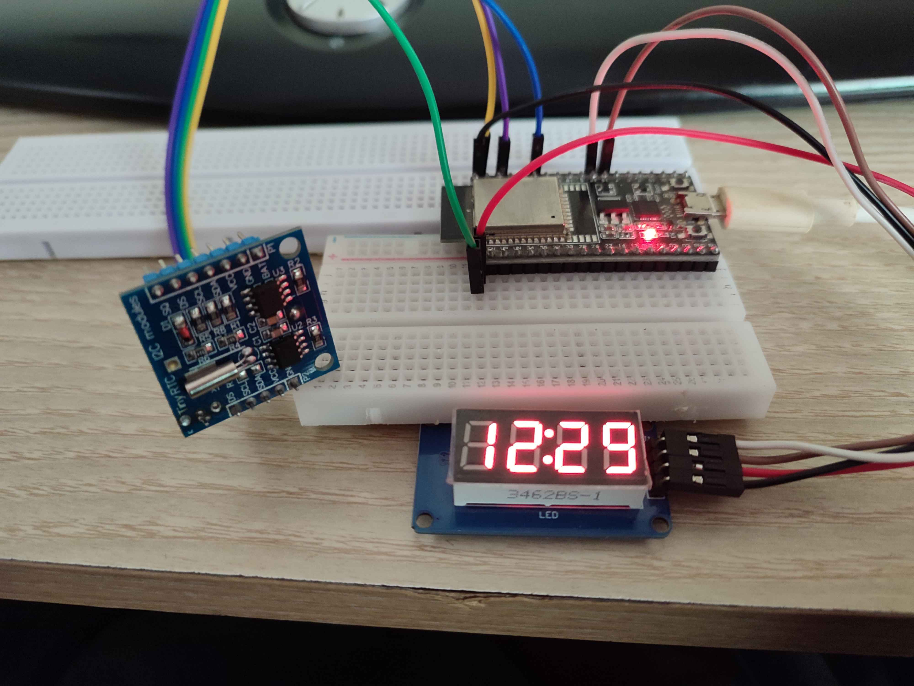
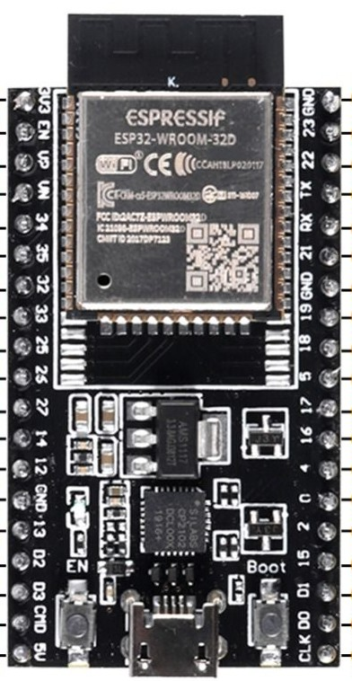
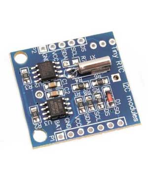
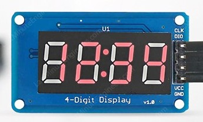
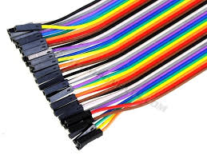
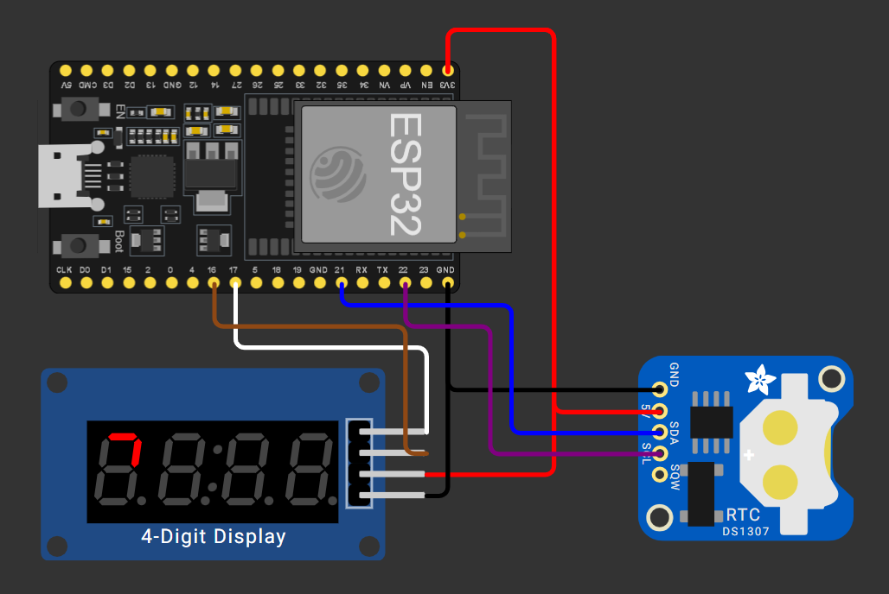
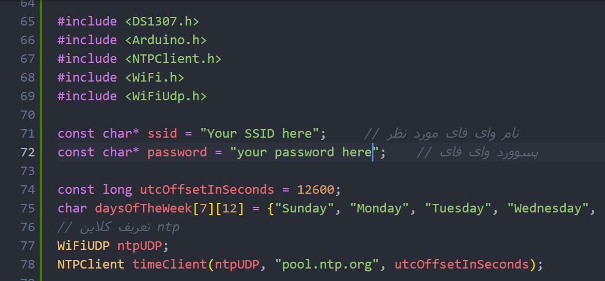

# ESP32-Digital-Clock
#### Digital Clock with ESP32 and 7-segment display

##### Required parts
| Parts | Model | Picture |
|:---:|:---:|:---:|
| ESP32 | `Dev Module WROOM-D` |  |
| RTC Module | `DS1307` |  |
| 7-Segment Display | `TM1637` |  |
| Jumper wire | `-` |  |

##### Wiring diagram

| `TM1637` | &rarr; | `ESP32` |
|:---:|:---:|:---:|
| `Gnd` | &rarr; | `GND` |
| `Vcc` | &rarr; | `3.3` |
| `CLK` | &rarr; | `17` |
| `DI0` | &rarr; | `16` |

| `DS1307` | &rarr; | `ESP32` |
|:---:|:---:|:---:|
| `Gnd` | &rarr; | `GND` |
| `Vcc` | &rarr; | `3.3` |
| `SDA` | &rarr; | `21` |
| `SCL` | &rarr; | `22` |

##### Required libraries
* `DS1307`
* `arduino-libraries/NTPClient@^3.2.1`
* `smougenot/TM1637@0.0.0-alpha+sha.9486982048`

> _Note_ : All libraries included in `platformio.ini` file
> _important note_: I have the DS1307 Library localy make sure install correct one

##### RTC setTime
if it's your first time using RTC Module or you haven't use it for a long time, you have to set the time manually. Don't worry I've a [script](./src/setTime.txt) for that! just copy and paste it into `main.cpp`, uncomment it and comment the rest of the code and finally upload it. Don't forget to edit WIFI ssid and password in the code.

##### Give it a STAR!
if you find this project useful, please give it a star.
